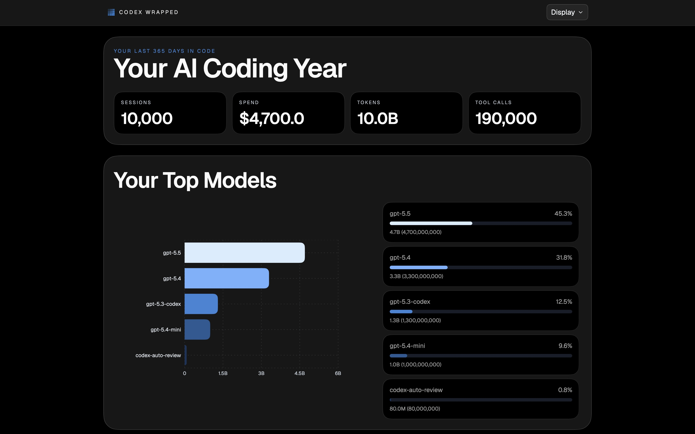

# Codex Wrapped

Codex Wrapped is a local dashboard that turns your Codex session history into a Spotify Wrapped-style report. It helps you see how often you use Codex, what you work on, which models and repos show up most, and how your activity changes over time. Everything runs locally on your machine, and the app can fall back to built-in pricing data when a model is not available locally.

Not affiliated with or endorsed by OpenAI.

## Screenshot



## Who This Is For

- Developers who use Codex and want a clear visual summary of their activity over time
- People who want a rough estimate of what that activity would cost through the API

## Key Features

- Wrapped-style cards and charts for sessions, tokens, cost, models, repos, and coding hours
- Theme switching with multiple palette options
- Date range selection for recent periods and yearly views
- Save each card as a PNG directly to your device
- Import and export full-history CSV backups for moving between computers
- Popup import feedback that surfaces backend rejection reasons

## Requirements

- Bun
- macOS, Linux, or Windows
- Local Codex history files in your home directory (`~/.codex`)

## Install / Quick Start

```bash
bun install
bun run build
bun ./bin/cli.ts
```

Open the app in your browser at:

```text
http://127.0.0.1:3210
```

On macOS, you can also double-click `Open Codex Wrapped.command` in the repo root to start the local server and open the app automatically.

## Usage

1. Start Codex Wrapped.
2. Let it scan your local Codex history.
3. Use the dashboard cards and charts to explore sessions, tokens, cost, repos, models, and activity patterns.
4. Use the footer actions to export a CSV backup, import one from another machine, or save any card as a PNG.
5. If you want command-line control, use `bun ./bin/cli.ts --help`, `bun ./bin/cli.ts --version`, `bun ./bin/cli.ts --uninstall`, or `PORT=4321 bun ./bin/cli.ts`.

## How It Works

1. Codex Wrapped reads Codex session logs from `~/.codex/sessions` and `~/.codex/archived_sessions` or the equivalent paths under `CODEX_HOME`.
2. The scanner parses each session into a normalized structure with events, tokens, costs, tools, models, timestamps, and repo context.
3. The app aggregates the normalized data into durable local history stored in `~/.codex-wrapped`.
4. If a model is missing from the built-in pricing table, the app can fetch pricing metadata from [models.dev](https://models.dev) and cache it locally.
5. The local Bun server serves the dashboard, and the frontend queries local RPC endpoints to render the cards and charts.

A few small details are worth knowing:

- Top Repos groups similar repository names and only shows the top 8 repositories
- Token totals include input, output, cached input/read, cache write, and reasoning tokens
- CSV backups are intentionally stable unless a future migration plan says otherwise

## FAQ

### Why is only one of my similar repositories shown?

Codex Wrapped consolidates similar repository names to avoid duplicate-looking entries in the Top Repos view. It groups names that share meaningful tokens and displays one canonical name. The card also shows only the top 8 repositories, so lower-ranked entries may not appear.

### How are the most active hour and busiest day of week calculated?

Most active hour is calculated from the selected date range by summing activity per hour of day and selecting the hour with the highest token total. Busiest day of week is calculated by summing tokens by weekday across the selected range and selecting the highest total. Weekly patterns are represented through the heatmap.

### What counts as a session?

A session is one parsed Codex session record from your local logs. During scanning, duplicate copies of the same session ID are deduplicated, and the preferred or latest copy is used for aggregation.

### Why do input and output tokens not add up to total tokens?

Total tokens include more than input and output. Codex Wrapped includes:

- input tokens
- output tokens
- cached input/read tokens
- cache write tokens
- reasoning tokens

Because of this, `input + output` will be lower than total whenever cache or reasoning tokens are present.

### Why was my import rejected?

Imports are validated by the backend and can be rejected when:

- the same backup file was already imported
- the CSV is invalid or not a Codex Wrapped backup format
- importing it would not change what is currently shown
- it only contains dates already covered by local data

When an import is rejected, the popup message shows the backend reason directly.

## Privacy

Codex Wrapped is local-first.

- Codex session logs are read locally from `~/.codex`
- Aggregated summaries are stored in `~/.codex-wrapped`
- Imported CSV backups are copied into `~/.codex-wrapped/imports`
- No external telemetry is required for core functionality
- Pricing fallback may fetch model pricing metadata from [models.dev](https://models.dev) when a model is not available locally

## Development

Run the app with the built frontend:

```bash
bun run dev
```

Run frontend HMR with the backend:

```bash
bun run dev:hmr
```

Typecheck:

```bash
bun run typecheck
```

Lint:

```bash
bun run lint
```

Format check:

```bash
bun run format:check
```

Format:

```bash
bun run format
```

Tests:

```bash
bun test
```

Clean build artifacts:

```bash
bun run clean
```

Set up repo-managed git hooks:

```bash
bun run prepare
```

See [docs/TESTING.md](docs/TESTING.md) for the full automated and manual regression checklist.

## Architecture

- `bin/cli.ts` - CLI entrypoint and Bun server bootstrap
- `src/bun` - scanning, parsing, aggregation, persistence
- `src/mainview` - React dashboard UI
- `src/shared` - shared schemas and types
- `docs/TESTING.md` - automated and manual regression checklist
- `~/.codex` - source Codex session logs
- `~/.codex-wrapped` - local scan/import history and dashboard store

## Troubleshooting

- If the UI looks stale during development, run `bun run build` before restarting `bun ./bin/cli.ts`.
- If data seems outdated, trigger a refresh or scan from the app and make sure your Codex directory exists.
- To move to a new computer, export a CSV backup from one machine and import that CSV on the new machine.
- To save a card image, use the save icon on the top-right edge of each card.
- If an import is rejected, the popup shows the reason directly. Common causes are a duplicate backup, an invalid CSV, no visible change, or dates already covered by local data.
- If port `3210` is busy, set `PORT` before launch:

```bash
PORT=4321 bun ./bin/cli.ts
```

## Contributing

Contributions are welcome.

1. Fork the repository and create a focused branch.
2. Make your change with clear commit messages.
3. Run `bun run typecheck` and `bun test` before opening a pull request.
4. For UI or data-flow changes, rebuild with `bun run build` and verify the live app.
5. Open a pull request with a concise summary and testing notes.

## Credits

- Started from ideas and inspiration from [gulivan/ai-wrapped](https://github.com/gulivan/ai-wrapped), then moved on to a Codex-only local dashboard with a more focused architecture and a cleaner visual design
- Used [JaceThings/Lisse](https://github.com/JaceThings/Lisse.git) as part of the UI and presentation reference work
- Card inspiration from [JeanMeijer/slopmeter](https://github.com/JeanMeijer/slopmeter)
- See [ThirdPartyNotices.txt](ThirdPartyNotices.txt) for bundled third-party notices

## License

MIT License. See [LICENSE](LICENSE) for full text.
