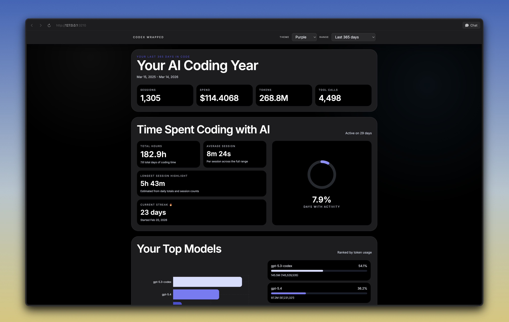

# Codex Wrapped

Codex Wrapped is a local dashboard that summarizes your Codex activity in a Spotify Wrapped–style dashboard. This project is a fork of [gulivan/ai-wrapped](https://github.com/gulivan/ai-wrapped) with a few improvements. Codex card inspiration from [JeanMeijer/slopmeter](https://github.com/JeanMeijer/slopmeter).

## Improvements in This Fork

- Visual redesign and UI polish across the dashboard
- Theme switching with multiple palette options
- Ability to save/share individual cards as PNG images
- Shift from the original app + multi-agent scope to a local website focused specifically on Codex-only support
- Improved pricing accuracy and handling of edge-case scenarios in cost calculations

## Preview

### Screenshot



---

### Video

[Watch preview video](assets/codex%20wrapped%20video.mp4)

Quick start:

```bash
bun install
bun run build
bun ./bin/cli.ts
```

## Key Features

- Theme switching (palette options in the sidebar)
- Date range selection (Last 7/30/90/365 days and yearly views)
- Wrapped-style cards and charts for sessions, tokens, cost, models, repos, and coding hours
- Save/share each card as PNG directly to your device

## For Users

### Who this is for

Codex Wrapped is for developers who use Codex regularly and want a clear, visual summary of how they code over time.

### Run The App

1. Start the app:

```bash
bun ./bin/cli.ts
```

2. Open:

`http://127.0.0.1:3210`

On macOS, you can also double-click `Open Codex Wrapped.command` in the repo root to start the local server and open the app.

## How It Works

1. **Local session discovery**: the scanner reads Codex session logs from `~/.codex/sessions` (or `CODEX_HOME/sessions`, or a configured custom Codex path).
2. **Parsing + normalization**: each session file is parsed into a consistent internal schema (events, tokens, costs, tools, model, timestamps, repo context).
3. **Aggregation**: normalized sessions are aggregated by day/hour/model/repo for fast dashboard queries.
4. **Local persistence**: aggregated artifacts and scan metadata are stored in `~/.codex-wrapped`.
5. **Pricing enrichment**: pricing is resolved locally from built-in mappings, and if a model is missing there, pricing data is fetched from [models.dev](https://models.dev) and cached for later lookups.
6. **UI rendering**: the local Bun server serves the dashboard, and the frontend queries local RPC endpoints to render cards/charts.

## Build & Development

### Prerequisites

- Bun (latest stable)
- macOS, Linux, or Windows
- Local Codex history files in your home directory (`~/.codex`)

### Quick Start (Source Build)

```bash
bun run build
bun ./bin/cli.ts
```

### Development

Run backend + built frontend:

```bash
bun run dev
```

Run frontend HMR + backend together:

```bash
bun run dev:hmr
```

Typecheck:

```bash
bun run typecheck
```

Run tests:

```bash
bun test
```

Clean build artifacts:

```bash
bun run clean
```

## CLI Options

These flags control local runtime behavior only (not provider selection).

```bash
bun ./bin/cli.ts --help
```

- `--version` or `-v`: show app version
- `--rebuild`: rebuild frontend assets before launch
- `--uninstall`: remove local Codex Wrapped data at `~/.codex-wrapped`

## Architecture

- `bin/cli.ts` — CLI entrypoint and Bun server bootstrap
- `src/bun` — scanning, parsing, aggregation, persistence
- `src/mainview` — React dashboard UI
- `src/shared` — shared schemas/types
- `~/.codex` — source Codex session logs
- `~/.codex-wrapped` — aggregated local data store

## Privacy

Codex Wrapped is local-first.

- Codex session logs are read locally from `~/.codex`
- Aggregated summaries are stored in `~/.codex-wrapped`
- Pricing fallback may fetch model pricing metadata from [models.dev](https://models.dev) when a model is not available in the local pricing map
- No external telemetry is required for core functionality

## Troubleshooting

- If the UI looks stale, run `bun ./bin/cli.ts --rebuild`.
- If data seems outdated, trigger a refresh/scan from the app and ensure your Codex directory exists.
- To save a card image, use the save icon on the top-right edge of each card; desktop browsers download PNG, and supported mobile browsers open native share/save.
- If the launcher reports an older server is still running, close duplicate `bun ./bin/cli.ts` processes and relaunch. The launcher will now try to stop stale Codex Wrapped processes automatically before starting.
- If port `3210` is busy, set `PORT` before launch:

```bash
PORT=4321 bun ./bin/cli.ts
```
